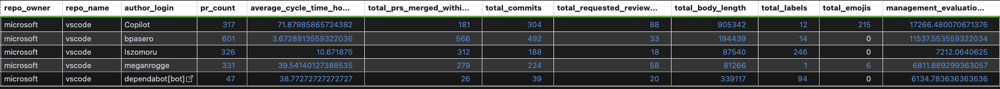
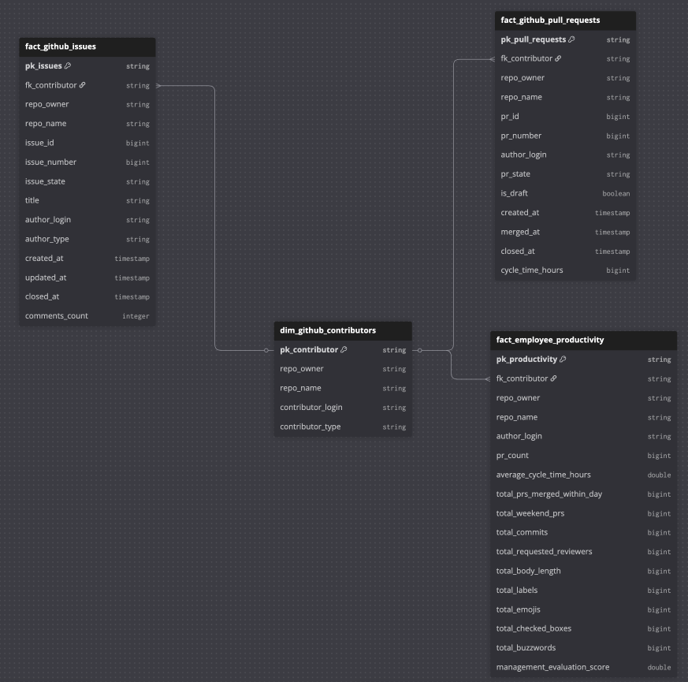

# Rituals Business Case

This repository implements an end-to-end GitHub analytics pipeline:

- Extract raw GitHub API data to DuckDB
- Transform raw data with dbt into analytics-ready models
- Produce KPI outputs for pull request, issue, and contributor performance

## 1. The Pipeline

- Extraction scripts:
    - `extract/extract_github.py`
    - `extract/db.py`
- Database sys table schema and creation:
    - `extract/sql/sys_pull_requests.sql`
    - `extract/sql/sys_issues.sql`
    - `extract/sql/sys_commits.sql`
- dbt transformation logic:
    - `dbt/business_case_dbt/models/staging/`
    - `dbt/business_case_dbt/models/intermediate/`
    - `dbt/business_case_dbt/models/mart/`

### Pipeline Flow

```text
GitHub API
-> DuckDB raw sys_* tables (extract)
-> staging models (type casting / normalization)
-> intermediate models (derived metrics)
-> mart models (KPIs)
```

## 2. Technical README

### Prerequisites

- Python 3.11+
- GitHub Personal Access Token (`GITHUB_TOKEN`)

### Setup

From project root:

```bash
python -m venv .venv
source .venv/bin/activate
pip install -r requirements.txt
```

Create `.env` in project root:

```env
GITHUB_TOKEN={your_token_here}
```

How to create the token:

1. Go to GitHub settings for tokens:
   https://github.com/settings/tokens
2. Create a token (classic or fine-grained) with read access to the target repository.
3. Copy the token value and paste it into `.env` as `GITHUB_TOKEN=...`.
4. Keep the token secret and never commit `.env` to git.

### Run Extractor

Example run:

```bash
python -m extract.extract_github --owner microsoft --repo vscode --since-days 10
```

CLI flags:

- `--owner` (required): GitHub owner/org
- `--repo` (required): GitHub repository
- `--since-days` (optional, default `1`): extraction window
- `--db-path` (optional, default `data/adh.duckdb`): DuckDB file

### Run dbt

1. Configure `~/.dbt/profiles.yml`:

```yml
business_case_dbt:
  target: dev
  outputs:
    dev:
      type: duckdb
      path: ../../data/adh.duckdb
      threads: 1
```

2. Build models:

```bash
cd dbt/business_case_dbt
dbt deps
dbt build
```

### Run Entire Project

```bash
source .venv/bin/activate
python -m extract.extract_github --owner microsoft --repo vscode --since-days 10
cd dbt/business_case_dbt
dbt deps
dbt build
```

### Data Model Overview (Grains and Keys)

| Layer | Model | Grain | Primary Key |
| --- | --- | --- | --- |
| Raw | `sys_github_pull_requests` | 1 PR | (`repo_owner`, `repo_name`, `pr_id`) |
| Raw | `sys_github_issues` | 1 issue | (`repo_owner`, `repo_name`, `issue_id`) |
| Raw | `sys_github_commits` | 1 commit | (`repo_owner`, `repo_name`, `sha`) |
| Staging | `stg_github_pull_requests` | 1 PR | (`repo_owner`, `repo_name`, `pr_id`) |
| Staging | `stg_github_issues` | 1 issue | (`repo_owner`, `repo_name`, `issue_id`) |
| Staging | `stg_github_commits` | 1 commit | (`repo_owner`, `repo_name`, `sha`) |
| Intermediate | `int_github_pull_requests` | 1 PR | `pk_pull_requests` (surrogate key) |
| Mart | `fact_github_pull_requests` | 1 PR | `pk_pull_requests` (surrogate key) |
| Mart | `fact_github_issues` | 1 issue | `pk_issues` (surrogate key) |
| Mart | `dim_github_contributors` | 1 contributor per repo | `pk_contributor` (surrogate key) |
| Mart | `fact_employee_productivity` | 1 contributor per repo | `pk_productivity` (surrogate key) |

### KPI Definitions (Precise)

- `cycle_time_hours`:

```sql
datediff('hour', created_at, merged_at)
```

Only for non-draft PRs with non-null `created_at` and `merged_at`.

- `pr_merged_within_day_flag`:

```sql
case when cycle_time_hours <= 24 then 1 else 0 end
```

- `average_cycle_time_hours`:

```sql
avg(cycle_time_hours)
```

Contributor-level average over non-draft PRs.

- `total_prs_merged_within_day`:

```sql
sum(pr_merged_within_day_flag)
```

- `total_weekend_prs`:

```sql
sum(case when strftime(created_at, '%w') in ('0', '6') then 1 else 0 end)
```

- `management_evaluation_score`:

```sql
(pr_count * 10)
+ (coalesce(total_commits, 0) * 2)
+ (total_requested_reviewers * -3)
+ (total_body_length * -0.01)
+ (total_labels * 5)
+ (total_checked_boxes * 5)
+ (total_buzzwords * 3)
+ (coalesce(total_prs_merged_within_day, 0) * 4)
+ (coalesce(total_weekend_prs, 0) * 6)
+ (coalesce(average_cycle_time_hours, 0) * -0.5)
```

## 3. Logic & Tradeoffs

Design decisions and assumptions:

- Keep raw payloads as JSON in `sys_*` tables for replayability and schema flexibility.
- Use layered dbt modeling (`staging -> intermediate -> mart`) for readability and maintainability.
- Use incremental extraction window (`--since-days`) to limit API load and run time.
- Use PR list endpoints for broad coverage, accepting that detailed diff fields are often missing.

Compromises:

- PR additions/deletions/comments/commit-count from list endpoint are unreliable and excluded from core KPI calculations.
- Contributor productivity score is heuristic and not a quality metric.
- Extraction depends on GitHub API availability/rate limits and token permissions.

## 4. Analytical Summary

For a typical run (e.g., `microsoft/vscode`, last 10 days), this pipeline enables:

- A manager to find the most productive contributors `management_evaluation_score`
    

    
- Create a report using the generated facts and dimensions
    

## 5. Future Roadmap

Planned enhancement for richer pull request metrics:

### Add PR detail extraction via
- `GET /repos/{owner}/{repo}/pulls/{pull_number}`
- Docs: `https://docs.github.com/en/rest/pulls/pulls?apiVersion=2022-11-28`

Why:

- Current PR list payload does not reliably populate these fields.
- These values are currently always null in list-based extraction.

Fields to add once PR detail extraction is implemented:

- `comments_count` (issue comments on the PR)
- `review_comments_count` (review comments on the PR)
- `commits_count` (number of commits in the PR)
- `additions` (lines added)
- `deletions` (lines deleted)
- `changed_files` (number of changed files)

### Make load incremental

Why:
- The current extractor uses a rolling `--since-days` window, which is partially incremental
- Smaller reprocessing windows reduce API usage and rate limit pressure

Approach:
- Use `source_updated_at` as column/metadata per entity (PRs, issues, commits)
- Store and query the latest `source_updated_at` already present in each `sys_*` table
- Re-extract only records updated since that watermark, plus a small overlap window to handle late updates

Implementation outline:
1. For each entity table (`sys_github_pull_requests`, `sys_github_issues`, `sys_github_commits`), compute a cutoff:
   - `cutoff = max(source_updated_at) - overlap_days`
   - If table is empty: `cutoff = now() - default_lookback_days`

2. Pass the cutoff into the GitHub API requests:
   - Pull requests: fetch sorted by `updated` and stop once `updated_at < cutoff`
   - Issues: fetch sorted by `updated` and stop once `updated_at < cutoff`
   - Commits: use `since=cutoff` (supported by the commits endpoint)

3. Upsert into DuckDB using the existing primary keys:
   - PRs: `(repo_owner, repo_name, pr_id)`
   - Issues: `(repo_owner, repo_name, issue_id)`
   - Commits: `(repo_owner, repo_name, sha)`
   - Update only when `raw_json` or `source_updated_at` changed; skip unchanged rows

4. Keep `_extracted_at` as the timestamp of the last actual change written to the row.

Key parameters:
- `default_lookback_days`: initial backfill window when the table is empty (e.g. 30 or 365)
- `overlap_days`: safety window to re-fetch recent history (e.g. 7–14 days)

Benefits:
- Faster extraction runs after the first load
- Less API usage and fewer rate limit issues
- Handles late edits (e.g. PR title/body edits, label changes, review requests)
- Safe to re-run without duplicates (business-key idempotent with change-aware upserts)
